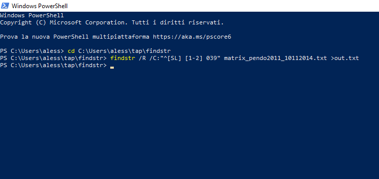

---

## Introduzione

Vista la necessità di operare con la **matrice** ISTAT del **pendolarismo** (versione 2011), ho scaricato dall'apposita sezione del sito (https://www.istat.it/it/archivio/139381) la relativa [cartella `.zip`](http://www.istat.it/storage/cartografia/matrici_pendolarismo/matrici_pendolarismo_2011.zip).


Nel file, insieme alla Alla matrice, è presente un documento metodologico che, oltre a descrivere la struttura dei dati, fornisce indicazioni utili per l'utilizzo della matrice, con particolare riferimento alle variabili rilevate con metodo campionario (mezzo di trasporto utilizzato, fascia oraria di partenza e durata del tragitto). Sono anche allegati alcuni documenti utili alla comprensione al corretto utilizzo dei dati (questionari e classificazioni).

Il file della matrice (in formato `.txt`) contiene i dati sul **numero di persone** che si **spostano tra comuni** – o all'interno dello stesso comune – classificate, oltre che per il **motivo dello spostamento**, per il sesso, il mezzo di trasporto utilizzato, la fascia oraria di partenza e la durata del tragitto.

È un file di testo con colonne a larghezza fissa e si presenta così:


Dovendo operare con i dati di una singola provincia, ho provato ad importarlo in Excel, ma la quantità di record presenti nel file (quasi 5 milioni di righe complessivamente) provocava l'eliminazione di circa 4/5 dei dati durante l'importazione (perché importa non più di circa un milione di righe).

## Come fare per ridurre il numero di record allo stretto necessario?

Cercando risposte online mi sono imbattuto [nella issue #105](https://github.com/opendatasicilia/tansignari/issues/105) - qui su t'ansignari - in cui i gentilissimi @aborruso e @pigreco discutevano di come filtrare tali record PRIMA di effettuare qualsiasi altra operazione, in modo da alleggerire il file e poter lavorare (su Excel o altrove) con un  numero decisamente più contenuto di record.
Io sono un utente Windows e Andrea Borruso mi ha indicato, a tal proposito, una stringa di ricerca da usare in Windows PowerShell, con l'*utility* `findstr`:

```
findstr /R /C:"^[SL] [1-2] 039" matrix_pendo2011_10112014.txt >out.txt
```

In ambiente Linux si può usare analogamente `grep`:

```
<matrix_pendo2011_10112014.txt grep -P '^[SL] [1-2] 039' >out.txt
```

Si tenga conto che `039` è un codice di provincia esemplificativo, mentre `out.txt` è il nome del file risultante che può essere modificato a piacimento.


Per i neofiti, come il sottoscritto, di stringhe, linguaggi di programmazione, shell come Windows PowerShell, la procedura per far sì che tale stringa funzioni è la seguente, spiegata anche in un video YouTube proprio da Andrea Borruso (<https://youtu.be/SeG0W0sS9P8>):

 1. Scarica la cartella contenente la matrice 2011 dal sito ISTAT;
 2. Crea una cartella di lavoro temporanea ad esempio in C:\windows\utenti\nomeutente, nominandola a piacimento (es. “tap”);
 3. Dentro a questa cartella, crea una ulteriore cartella nominandola a piacere (es. “findstr”);
 4. Copia il file.txt contenente i record della matrice ed incollalo dentro quest'ultima cartella;
 5. Accedi su Microsoft PowerShell;
 6. Digita “cd” e copia il percorso della tabella “findstr” creata in precedenza, poi premi INVIO;
 7. Scrivi `findstr /R /C:"^[SL] [1-2] 039" matrix_pendo2011_10112014.txt >out.txt` e dai `INVIO`;
 8. All'interno della cartella `findstr` troverai il file con i record desiderati!

Sarà un file di dimensioni sensibilmente inferiori, che potrà essere importato senza problemi in un foglio elettronico.





## Chi ha cucinato questa ricetta o ne ha tratto ispirazione

- [Blog post](https://pigrecoinfinito.com/2020/01/15/pendolarismo-come-creare-un-hub-line-con-qgis/) su Pigrecoinfinito by  _[Totò Fiandaca](https://twitter.com/totofiandaca?lang=it)_
